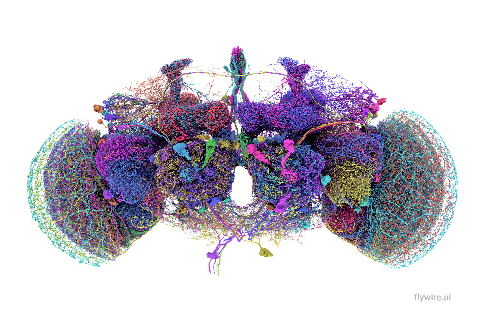

# flywire-tools


## You _really_ should use the connectome.

### Flywire and Neuprint 
There are two established connectomes available with really user-friendly interfaces: [Flywire.ai](https://flywire.ai/) and [neuPrint+](https://neuprint.janelia.org/). I recommend you try them out to get a good idea of the kinds of data available. 

But the wiring diagram is HUGE (140,000 cells forming 50 million synapses). So if you plan to use them for analyzing connections between many different cells, you ought to work with the connectome programmatically. 

Here I've developed some tools for interacting with the flywire connectome. I've downloaded the spreadsheet containing all connections in the flywire connectome (with the latest available [here](https://codex.flywire.ai/api/download)). This allows for really large queries that are above the limit for the number of permitted calls for the flywire APIs.

Online interfaces also only provide connections with at least 5 synapses, by default, and a strict minimum of 2. Assuming these tools are only really useful for generating _hypotheses_ about cell and circuit function, I wanted a more statistical approach that queries all connections and allows for thresholding later in the pipeline.

Among these tools are routines for:
  - Automated **pathway analysis** for connections going up- or downstream using a variety of search parameters
  - Measuring the **connectivity** between many different cell types and generating corresponding figures
  - Finding shared **downstream partners** of pairs of cell types, to identify cells likely to integrate those corresponding signals
  - Performing **Monte Carlo simulations** to empirically determine which pathways are more or less likely while accounting for nonlinearities in the wiring diagram
  - Computing **synaptic fields** for visual projection neurons: the contribution of each retinal column to a neuron's input, propagated analytically or via Monte Carlo through the connectome subgraph
  - **Plotting** results with systematic coloring schemes using Neuroglancer

Much of this is still ongoing and has been built from the tools provided by the [navis module](https://navis-org.github.io/navis/) and its affiliates.

---

## Downstream Synaptic Field Analysis

The library includes an analytic pipeline for computing **synaptic fields** — spatial maps of how strongly each retinal column drives a given visual projection neuron (e.g. LC11, LPLC2).  Two propagation backends are available:

- **Analytic** (`compute_downstream_or_load`): exact first-passage probabilities computed by iterating a sparse transition matrix. Deterministic, no sampling noise, fast for typical LC/LPLC subgraphs.
- **Monte Carlo** (`compute_downstream_mc_or_load`): random-walk simulation through the same subgraph. Converges as reps → ∞ and retains full trajectory detail.

Both backends cache results as `.npz` files and support three normalization modes controlled by `normalize` and `conditional`:

```python
import field_plotting as fp

# unconditional probability — leaky walk, full-connectome denominator (default)
fields = fp.compute_downstream_or_load(connectome, 'LC11', hops=3)

# conditional probability — walk constrained to the input subgraph
fields = fp.compute_downstream_or_load(connectome, 'LC11', hops=3, conditional=True)

# raw synapse-weighted path counts (no probability interpretation)
fields = fp.compute_downstream_or_load(connectome, 'LC11', hops=3, normalize=False)
```

See [`docs/synaptic_fields_pipeline.md`](docs/synaptic_fields_pipeline.md) for the full pipeline description and [`docs/graph_propagation.md`](docs/graph_propagation.md) for the underlying math.

---

### Installation
The stable version of this library can be installed using pip:
```
pip install flywire-tools
```
Or, to download the current version straight from this repo:
```
pip install git+https://github.com/jpcurrea/flywire-tools.git
```
Alternatively, you can clone this repo and the run pip install from inside the cloned repo:
```
git clone https://github.com/jpcurrea/flywire-tools.git
cd flywire-tools
pip install .
```

## [Flywire through Navis: the basics](docs/startup.ipynb)

## [Documentation](docs/api_tutorial.ipynb)
