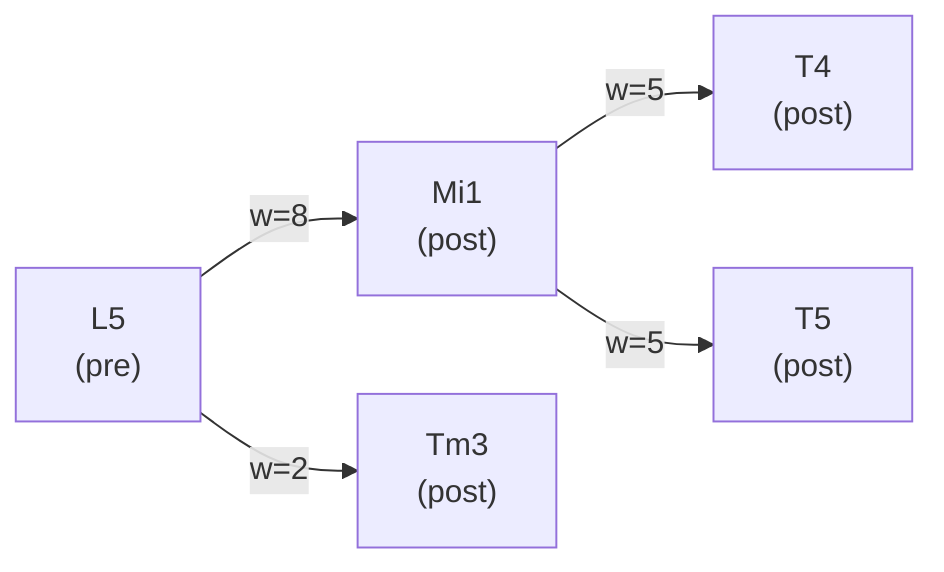
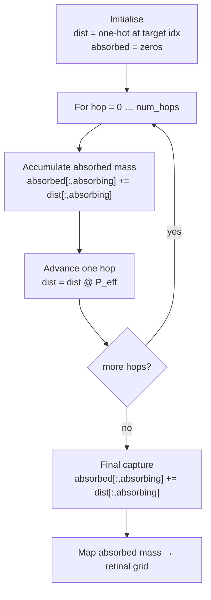
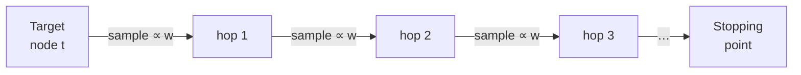

# Graph propagation in `Paths`

This document explains how the `Paths` class in `connectome.py` represents and walks the connectome graph, covering three topics:

1. [Building the transition matrix as a CSR matrix](#1-transition-matrix)
2. [Propagating probability mass hop-by-hop (analytic)](#2-hop-wise-propagation)
3. [Running Monte Carlo simulations through the graph](#3-monte-carlo-simulation)

---

## 1. Transition matrix

### The graph

The connectome is stored as a directed, weighted `networkx` graph where each node is a neuron (`root_id`) and each edge carries a synapse-count `weight`.



### From weights to probabilities

For a downstream walk, each pre-synaptic neuron distributes its "walker" to post-synaptic targets **in proportion to synapse count**.  The transition matrix $P$ is therefore **row-stochastic**: each row sums to 1 (or 0 for dead-end nodes).

$$
P_{ij} = \frac{w_{ij}}{\sum_k w_{ik}}
$$

For an *upstream* walk the edge direction is reversed: $i$ is the post-synaptic node and $j$ is the pre-synaptic node.

### CSR construction (`_build_transition_matrix`)

```python
# 1. Collect all edges into parallel arrays
us, vs, ws   # source indices, target indices, weights

# 2. Map node IDs to contiguous matrix indices
u_idx = np.searchsorted(node_ids, us)
v_idx = np.searchsorted(node_ids, vs)

# 3. Build raw weight matrix (duplicate entries are summed automatically)
P = sp.csr_matrix((ws, (rows, cols)), shape=(N, N))

# 4. Row-normalise
row_sums = P.sum(axis=1)           # (N, 1)
P = sp.diags(1 / row_sums) @ P    # broadcast per-row division
```

The key properties of the resulting CSR matrix:

| Property | Value |
|---|---|
| Shape | $N \times N$ (one row/column per neuron) |
| Non-zeros | One per directed synapse group |
| Row sum | 1 (non-dead-end nodes), 0 (dead-ends) |
| Storage | Compressed sparse row — $O(\text{edges})$ memory |

---

## 2. Hop-wise propagation (analytic)

### Idea: mass flows through the graph

Each target neuron (level 0) starts with **one unit of probability mass** at its own node.  At each hop the mass is multiplied by $P$, spreading it one synapse further.  Input-layer neurons (e.g. L5, R7) are designated **absorbing**: mass that reaches them is accumulated and their outgoing edges are zeroed so the walk stops on first arrival.

$$
\mathbf{d}^{(0)} = \mathbf{e}_{\text{target}}
\qquad
\mathbf{d}^{(h+1)} = \mathbf{d}^{(h)} \, P_\text{eff}
$$

where $P_\text{eff}$ is $P$ with the rows of absorbing nodes zeroed:

$$
P_\text{eff} = \operatorname{diag}(\lnot\,\mathbf{a}) \cdot P
$$

($\mathbf{a}$ is a boolean vector marking absorbing nodes.)

### Absorption loop



After the loop, `absorbed[t, j]` is the **first-passage probability** that a walk starting at target $t$ first reaches absorbing node $j$.  These probabilities are then scatter-added onto the $(p, q)$ retinal grid using each input neuron's column coordinates, producing a spatial synaptic field.

### Optional conditioning

When `conditional=True`, each target's field is divided by the total absorbed mass:

$$
\tilde{P}(j \mid t) = \frac{P(j, t)}{\sum_{k \in \text{absorbing}} P(k, t)}
$$

This converts absolute first-passage probabilities into a **distribution over retinal origin**, given that the walk reached *some* input layer.

---

## 3. Monte Carlo simulation

### One walk, one random path

Rather than computing exact probabilities, the Monte Carlo backend **samples** from the transition distribution at each hop.  For a single walker starting at target $t$:



The outcome for each replicate is the **sequence of node indices** visited, stored as a path `[t, n₁, n₂, …, nₖ]`.

### Storage layout

Because the full simulation can be large (`num_starting_cells × num_levels × reps`), paths are written **chunk-by-chunk** into an HDF5 dataset:

```
paths_ds  shape: (num_starting_cells, num_levels, reps)
           dtype: int64   (node index into all_nodes)
```

One HDF5 chunk = one starting cell, keeping I/O sequential and memory bounded.

### Sampling step (inner loop)

```python
for level_ind in range(num_levels - 1):
    pre_nodes = chunk[0, level_ind]           # (reps,) current position indices
    for node_ind, count in unique_counts:
        post_nodes = graph.successors(node_val)   # downstream neighbours
        weights /= weights.sum()                  # local normalisation
        sample = np.random.choice(post_nodes, size=count, p=weights)
        chunk[0, level_ind + 1, mask] = searchsorted(all_nodes, sample)
```

The weighted `np.random.choice` is the discrete analogue of multiplying by a row of $P$.

### Analytic vs Monte Carlo

| | Analytic | NetworkX MC | Matrix MC |
|---|---|---|---|
| Computes | Exact first-passage probabilities | Sampled path histograms | Sampled path histograms |
| Requires | Transition matrix only | NetworkX graph traversal | Transition matrix only |
| Memory | $O(N^2)$ dense absorbed array | $O(S \times H \times R)$ HDF5 | $O(S \times H \times R)$ HDF5 |
| Pathway detail | No | Full trajectory available | Full trajectory available |
| Runtime | $O(N^2 \times H)$ | $O(S \times H \times R \times \bar{d})$ | $O(S \times H \times R \times \bar{d})$ |
| Speedup source | — | — | Avoids per-node NetworkX dict lookups and weight recomputation; same asymptotic cost |
| API | `method='analytic'` | `monte_carlo()` | `monte_carlo_matrix()` |
| Convergence | Exact | As $R \to \infty$ | As $R \to \infty$ |
| Drop-in replacement | — | — | Yes — same HDF5 output format |

*Variable key — $N$: total nodes in graph; $H$: graph depth (number of hops / levels); $S$: number of starting (level-0 target) cells; $R$: number of Monte Carlo replicates per starting cell; $\bar{d}$: mean number of unique nodes occupied per hop (much less than $N$).*

Both stochastic methods converge to the analytic result as $R \to \infty$. The matrix MC replaces per-node NetworkX dict lookups with direct CSR array indexing, giving a constant-factor speedup that is most noticeable on large, dense subgraphs.
